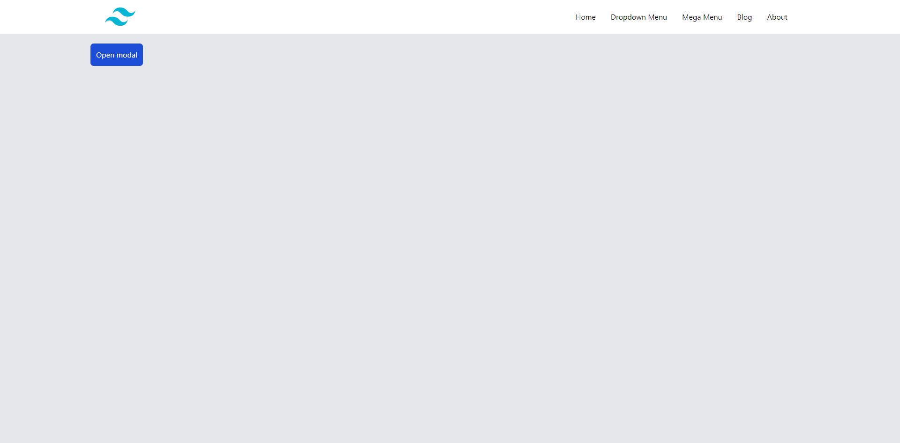
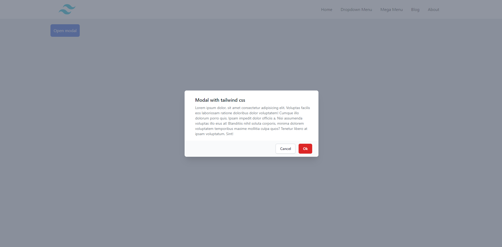

<h1 style="text-align:center">HTML-TailwindCSS-Template</h1>

A starter template for HTML, CSS and JavaScript projects using TailwindCSS. Animate.css Wow.js have also been initailized for animation along with jQuery. Also adding some components like responsive nav menu, modals, accordion, tabs.

[See Project](https://sazzad-anwar.github.io/HTML-TailwindCSS-Template/)

